# Integración Moodle 5.0 con Microsoft Entra ID
## Guía de Implementación Paso a Paso

**LABCLOUDSOLUTIONS — cloudlab.cl | Versión 1.0 — Abril 2026**

---

## Índice

1. [Prerrequisitos](#1-prerrequisitos)
2. [Registro de Aplicación en Entra ID](#2-registro-de-aplicación-en-entra-id)
3. [Instalación de Plugins en Moodle](#3-instalación-de-plugins-en-moodle)
4. [Configuración del Plugin auth_oidc](#4-configuración-del-plugin-auth_oidc)
5. [Configuración del Plugin local_o365](#5-configuración-del-plugin-local_o365)
6. [Configuración de Grupos y Matriculación Automática](#6-configuración-de-grupos-y-matriculación-automática)
7. [Plugin local_loginsync — Matriculación Instantánea](#7-plugin-local_loginsync--matriculación-instantánea)
8. [Verificación Final](#8-verificación-final)

---

## 1. Prerrequisitos

### 1.1 Infraestructura Azure

| Componente | Detalle |
|---|---|
| Azure Tenant | Tenant activo con dominio personalizado verificado (ej: cloudlab.cl) |
| Dominio personalizado | Verificado en Entra ID — no usar el dominio .onmicrosoft.com |
| Suscripción activa | Con permisos de Colaborador o superior en el Resource Group |

### 1.2 Servidor Moodle

| Componente | Detalle |
|---|---|
| Versión Moodle | 5.0.2 o superior |
| PHP | 8.3 o superior |
| Servidor web | Apache 2.4 con mod_rewrite habilitado |
| HTTPS | Certificado SSL válido (Cloudflare Full Strict o similar) |
| Base de datos | MySQL 8.0+ o compatible |

### 1.3 Plugins requeridos

Descargar desde https://moodle.org/plugins — seleccionar versión compatible con Moodle 5.0:

| Plugin | Propósito |
|---|---|
| auth_oidc | OpenID Connect Authentication — autenticación vía Entra ID |
| local_o365 | Microsoft 365 Integration — sincronización de grupos y cohortes |

> ⚠️ Verificar compatibilidad de versión del plugin con Moodle antes de descargar.

### 1.4 Cursos en Moodle

Crear los cursos antes de configurar la matriculación automática.

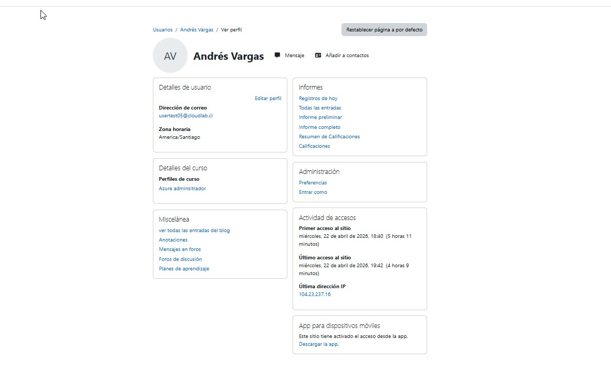
*Cursos creados en Moodle — destino de la matriculación automática*

---

## 2. Registro de Aplicación en Entra ID

### 2.1 Crear App Registration

1. Ir a: Portal Azure → Microsoft Entra ID → **Registros de aplicaciones** → Nuevo registro
2. Configurar:
   - Nombre: `moodle-app`
   - Tipos de cuenta: Solo cuentas en este directorio organizativo
   - URI de redirección: `https://aula.tudominio.cl/auth/oidc/` (tipo Web)
3. Guardar y anotar: **Application (client) ID** y **Directory (tenant) ID**

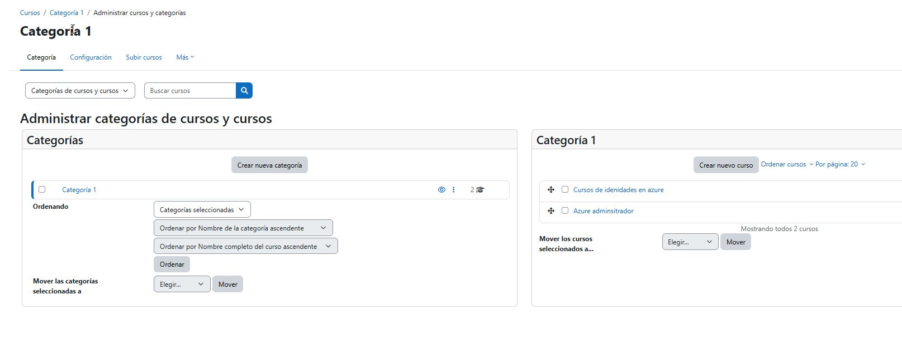
*Vista de Registros de aplicaciones — tab Aplicaciones propias*

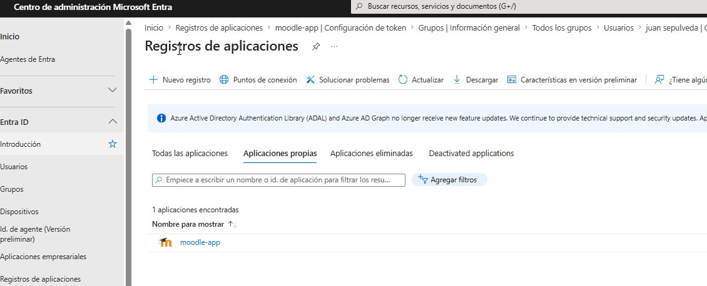
*App Registration `moodle-app` creada exitosamente*

### 2.2 Crear Client Secret

1. App Registration → **Certificados y secretos** → Nuevo secreto de cliente
2. Definir descripción y expiración
3. Copiar el valor inmediatamente — no será visible nuevamente

> ⚠️ Guardar Client ID, Tenant ID y Client Secret de forma segura antes de continuar.

### 2.3 Configurar permisos de API

App Registration → **Permisos de API** → Agregar permiso → Microsoft Graph:

| Permiso | Tipo | Propósito |
|---|---|---|
| User.Read | Delegado | Lectura de perfil del usuario autenticado |
| GroupMember.Read.All | Aplicación | Leer membresía de grupos |
| User.Read.All | Aplicación | Sincronización de usuarios |
| Directory.Read.All | Aplicación | Lectura del directorio |

Otorgar **consentimiento de administrador** después de agregar los permisos.

### 2.4 Agregar Claims opcionales al ID Token

App Registration → **Configuración de token** → Agregar notificación opcional → Tipo: **ID**

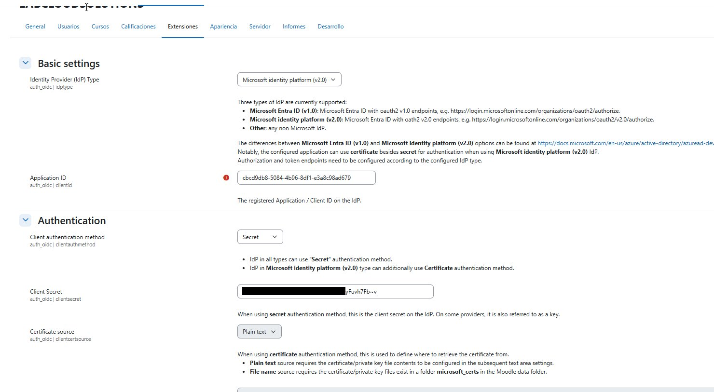
*Claims opcionales agregados al ID token: given_name, family_name, email, groups, ctry*

| Claim | Descripción |
|---|---|
| given_name | Nombre del usuario — se mapea al campo Nombre en Moodle |
| family_name | Apellido del usuario — se mapea al campo Apellido en Moodle |
| email | Correo electrónico del usuario |
| groups | Object IDs de los grupos a los que pertenece el usuario |

> ⚠️ El claim `groups` devuelve Object IDs (GUIDs), no nombres. La resolución a nombres se realiza via Graph API por el plugin local_o365.

### 2.5 Configurar Redirect URIs

App Registration → **Authentication** → verificar URIs de redirección:

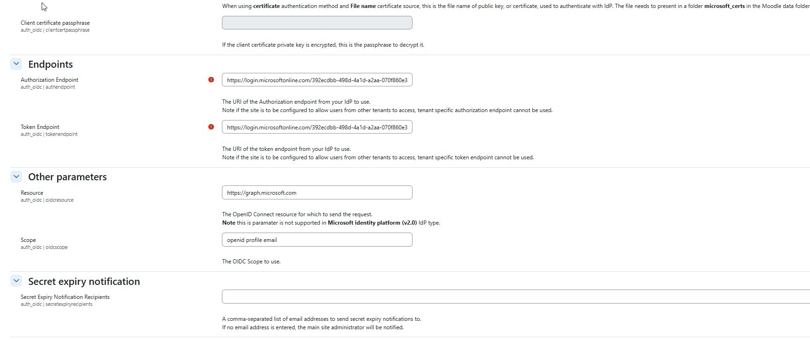
*URIs de redirección requeridas para la integración con Moodle*

| URI | Propósito |
|---|---|
| `https://aula.cloudlab.cl/auth/oidc/` | Endpoint principal OIDC |
| `https://aula.cloudlab.cl/local/o365/sso_end.php` | Single Sign-Out del plugin local_o365 |
| `https://aula.cloudlab.cl/` | Redirect base del sitio |

---

## 3. Instalación de Plugins en Moodle

### 3.1 Instalar auth_oidc

1. Site administration → Plugins → **Install plugins** → subir ZIP de auth_oidc
2. Seguir el wizard de instalación
3. Verificar en: Site admin → Plugins → Authentication → Manage authentication

### 3.2 Instalar local_o365

1. Site administration → Plugins → **Install plugins** → subir ZIP de local_o365
2. Seguir el wizard de instalación

> ⚠️ local_o365 requiere auth_oidc instalado previamente para funcionar correctamente.

---

## 4. Configuración del Plugin auth_oidc

### 4.1 Datos de conexión

Site administration → Plugins → Authentication → **OpenID Connect** → Settings:

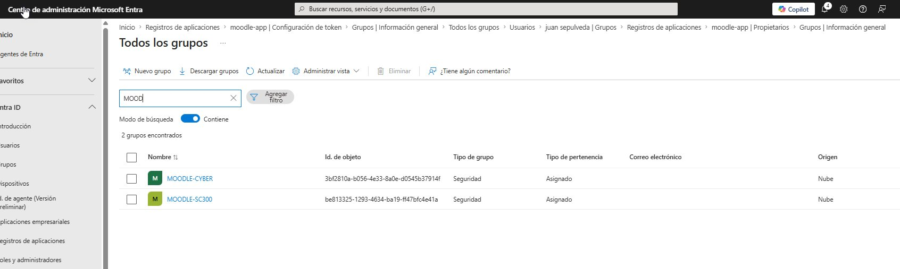
*Pantalla principal de auth_oidc — muestra la Redirect URI que debe registrarse en Entra ID*

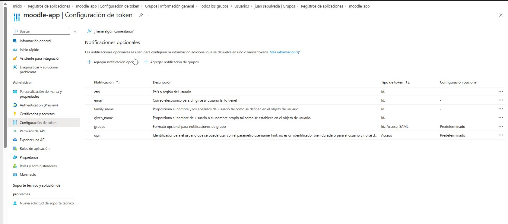
*Configuración de Identity Provider, Application ID y Client Secret*

| Campo | Valor |
|---|---|
| Identity Provider Type | Microsoft identity platform (v2.0) |
| Application ID | Client ID obtenido en paso 2.1 |
| Client Secret | Secreto creado en paso 2.2 |
| Client auth method | Secret |

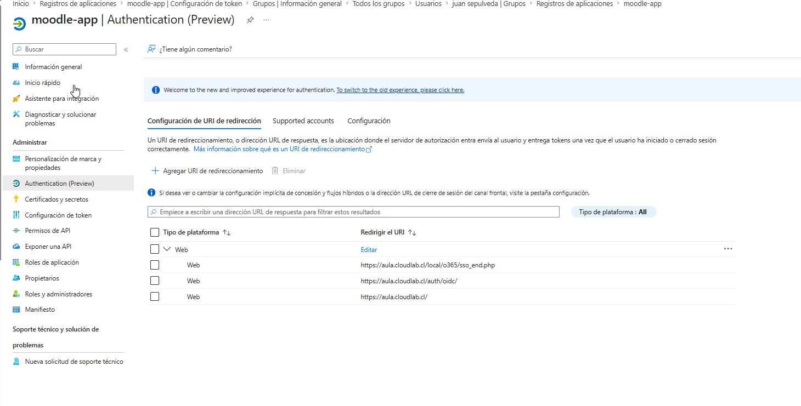
*Configuración de Authorization Endpoint, Token Endpoint y Scope*

| Campo | Valor |
|---|---|
| Authorization Endpoint | `https://login.microsoftonline.com/{tenant-id}/v2.0` |
| Token Endpoint | `https://login.microsoftonline.com/{tenant-id}/v2.0` |
| Scope | `openid profile email` |

### 4.2 Mapeo de campos (Field Mappings)

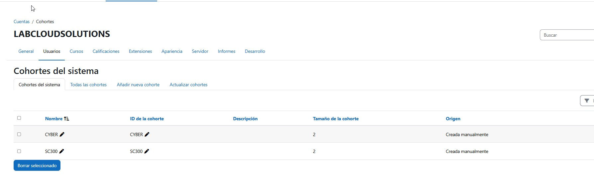
*Mapeo de claims del token a campos de perfil en Moodle*

| Campo Moodle | Claim token | Actualizar local |
|---|---|---|
| Nombre | Given Name | On creation, every login and sync |
| Apellido(s) | Surname | On creation, every login and sync |
| Correo electrónico | Email | On creation, every login and sync |

> ⚠️ Sin los claims `given_name` y `family_name` configurados en Entra ID (paso 2.4), estos campos llegarán vacíos aunque el mapeo esté correcto.

### 4.3 Verificación del token

Después de que un usuario haga login, verificar el payload del JWT:

```bash
mysql -h <db-host> -u <user> -p -D moodle \
  -e "SELECT idtoken FROM mdl_auth_oidc_token ORDER BY id DESC LIMIT 1\G" \
  | grep idtoken | awk '{print $2}' | cut -d'.' -f2 | base64 -d 2>/dev/null | python3 -m json.tool
```

Confirmar que el payload contiene: `given_name`, `family_name`, `email`, `groups`, `iss`, `aud`, `tid`

---

## 5. Configuración del Plugin local_o365

### 5.1 Configuración inicial

Site administration → Plugins → **Microsoft 365 Integration** → Configuration:

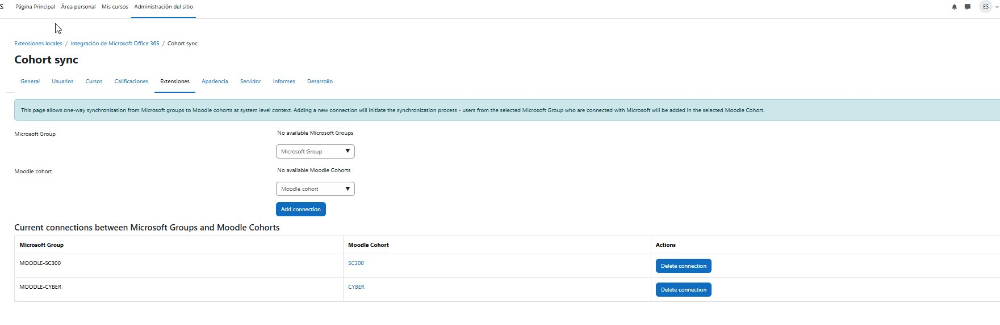
*Configuración de local_o365 con todos los checks en verde — Reply URL, API unificada y permisos correctos*

1. Paso 1/3: Ingresar Application ID y Client Secret
2. Paso 2/3: Ingresar tenant (`cloudlab.cl`) → Detectar → verificar que el abonado es válido
3. Paso 3/3: **Provide Admin Consent** — autenticarse con cuenta Global Admin de Entra ID
4. Clic en **Actualizar** y verificar que todos los checks aparezcan en verde

### 5.2 Sync Settings

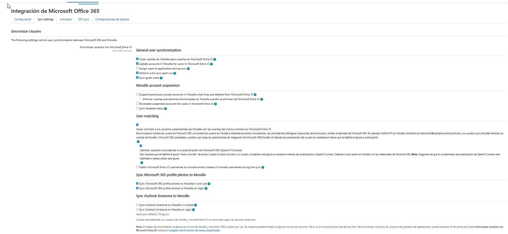
*Configuración de sincronización de usuarios entre Entra ID y Moodle*

Configuración recomendada:

| Opción | Estado |
|---|---|
| Crear cuentas en Moodle para usuarios en Microsoft Entra ID | ✅ Habilitado |
| Update accounts in Moodle for users in Microsoft Entra ID | ✅ Habilitado |
| Perform a full sync each run | ✅ Habilitado |
| User matching | ✅ Habilitado |
| Cambiar usuarios coincidentes a autenticación OpenID Connect | ✅ Habilitado |
| Sync Microsoft 365 profile photos to Moodle in cron job | ✅ Habilitado |
| Sync Microsoft 365 profile photos to Moodle on login | ✅ Habilitado |

---

## 6. Configuración de Grupos y Matriculación Automática

### 6.1 Crear grupos en Entra ID

1. Portal Azure → Entra ID → **Grupos** → Nuevo grupo
2. Tipo: Seguridad, Asignado
3. Nombre sugerido: `MOODLE-<NOMBRE_CURSO>`
4. Agregar miembros al grupo
5. Anotar el **Object ID** de cada grupo

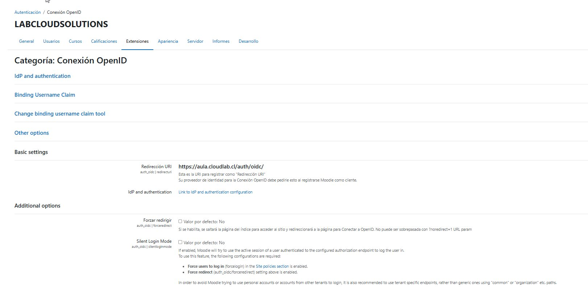
*Grupos de seguridad creados en Entra ID con convención de nombres MOODLE-*

### 6.2 Crear cohortes en Moodle

1. Site administration → Users → **Cohorts** → Añadir nueva cohorte
2. Crear una cohorte por cada grupo de Entra ID (Context: System)

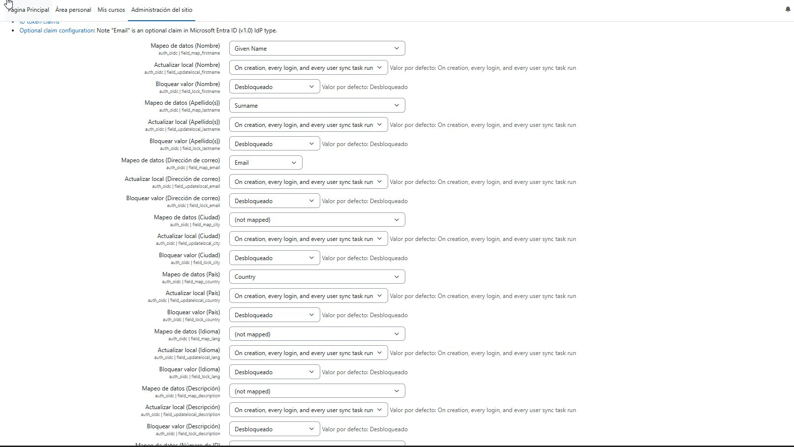
*Cohortes del sistema creadas — CYBER con 2 miembros y SC300 con 2 miembros tras la sincronización*

### 6.3 Mapear grupos Entra ID a cohortes Moodle

Site admin → Plugins → Microsoft 365 Integration → Sync Settings → **Manage Cohort sync**

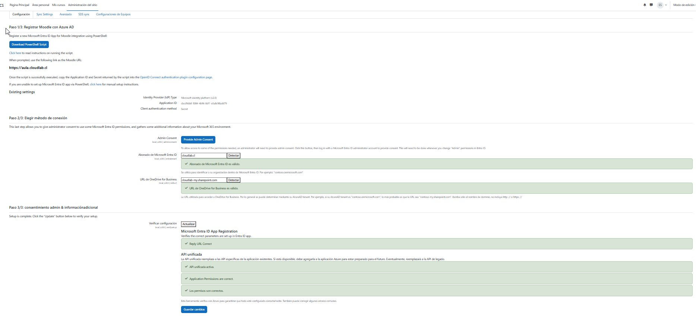
*Conexiones activas: MOODLE-SC300 → SC300 y MOODLE-CYBER → CYBER*

Para cada grupo, seleccionar el Microsoft Group y la Moodle cohort correspondiente → **Add connection**.

### 6.4 Configurar matriculación por cohorte en cada curso

Curso → Participantes → Métodos de matriculación → Añadir método → **Sincronizar cohorte**

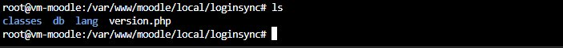
*Selección de cohorte SC300 como método de matriculación en el curso*

### 6.5 Ejecutar sincronización inicial

```bash
# 1. Sincronizar usuarios con Entra ID
sudo -u www-data php /var/www/moodle/admin/cli/scheduled_task.php \
  --execute=\\local_o365\\task\\usersync

# 2. Sincronizar cohortes con grupos
sudo -u www-data php /var/www/moodle/admin/cli/scheduled_task.php \
  --execute=\\local_o365\\task\\cohortsync

# 3. Sincronizar matriculaciones
sudo -u www-data php /var/www/moodle/admin/cli/scheduled_task.php \
  --execute=\\enrol_cohort\\task\\enrol_cohort_sync
```

---

## 7. Plugin local_loginsync — Matriculación Instantánea

Plugin personalizado que ejecuta el cohort sync en el momento del login OIDC, eliminando el delay del cron job.

### 7.1 Descripción

| Componente | Detalle |
|---|---|
| Componente | local_loginsync |
| Evento escuchado | `\core\event\user_loggedin` |
| Condición | Solo usuarios autenticados con auth = oidc |
| Tareas ejecutadas | `local_o365\task\cohortsync` + `enrol_cohort\task\enrol_cohort_sync` |
| Tipo de ejecución | Síncrona — el usuario ve el curso al terminar el login |

### 7.2 Estructura del plugin


*Estructura de directorios del plugin en `/var/www/moodle/local/loginsync/`*

```
local_loginsync/
├── version.php
├── db/
│   └── events.php          ← registra observer para user_loggedin
├── lang/en/
│   └── local_loginsync.php ← strings de idioma requeridos
└── classes/
    └── observer.php        ← lógica principal
```

### 7.3 Instalación

1. Site administration → Plugins → Install plugins → subir `local_loginsync_v1.zip`
2. Completar el wizard de instalación
3. Verificar que aparece en la lista de plugins locales
4. Probar: hacer login con usuario OIDC y verificar matriculación inmediata

---

## 8. Verificación Final

### 8.1 Resultado esperado

Al completar la implementación, un usuario que pertenezca a un grupo de Entra ID mapeado debe:

1. Poder autenticarse con sus credenciales de Microsoft
2. Tener nombre y apellido poblados automáticamente desde el token
3. Aparecer matriculado en el curso correspondiente inmediatamente tras el login

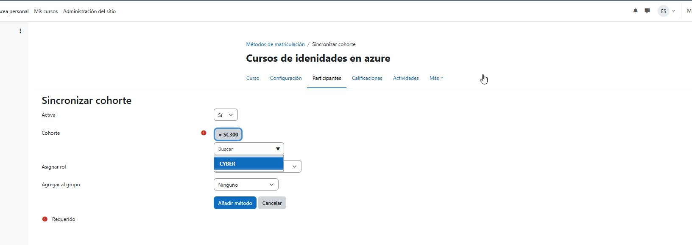
*Perfil del usuario Andrés Vargas creado automáticamente — nombre, apellido y correo poblados desde Entra ID, matriculado en el curso "Azure administrador"*

### 8.2 Checklist de validación

| Verificación | Estado esperado |
|---|---|
| Usuario puede hacer login con cuenta de Entra ID | ✅ Login exitoso |
| Nombre y apellido se llenan automáticamente | ✅ Campos poblados |
| Token JWT contiene given_name y family_name | ✅ Claims presentes |
| Token JWT contiene groups (Object IDs) | ✅ GUIDs de grupos |
| Cohortes mapeadas a grupos en Cohort sync | ✅ Conexión activa |
| Curso tiene método Sincronizar cohorte | ✅ Enrolment activo |
| Usuario ve el curso al terminar el login | ✅ Matriculación inmediata |
| Plugin local_loginsync instalado y activo | ✅ Observer registrado |

### 8.3 Comandos útiles de diagnóstico

```bash
# Ver último token recibido
mysql -h <db-host> -u <user> -p -D moodle \
  -e "SELECT userid, username, oidcusername, scope FROM mdl_auth_oidc_token ORDER BY id DESC LIMIT 5;"

# Verificar cohortes y cantidad de miembros
mysql -h <db-host> -u <user> -p -D moodle \
  -e "SELECT c.name, COUNT(cm.userid) as members FROM mdl_cohort c LEFT JOIN mdl_cohort_members cm ON c.id=cm.cohortid GROUP BY c.name;"

# Ejecutar cohort sync manualmente
sudo -u www-data php /var/www/moodle/admin/cli/scheduled_task.php \
  --execute=\\local_o365\\task\\cohortsync
```

---

*LABCLOUDSOLUTIONS — cloudlab.cl | Documento interno — Versión 1.0*
